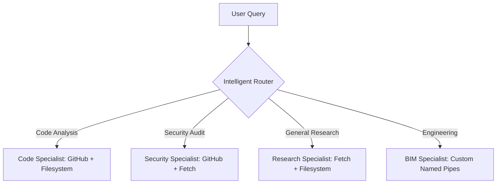

# 🧩 Pixra AI Hub

Next-generation intelligence orchestration. **Pixra AI Hub** leverages the Model Context Protocol (MCP) to deploy a fleet of specialized AI agents, transforming complex queries into high-precision automated outcomes.

Rather than relying on a single generalist model, Pixra utilizes an intelligent router to delegate tasks to domain-specific specialists—ensuring your data is processed by the exact tools and context required for the job.

## 🚀 Features

- **Specialized Agentic Workflows**: Purpose-built agents for **Code Review**, **Security Auditing**, **Deep Research**, and **BIM Engineering**.
- **Dynamic MCP Routing**: Seamlessly connects agents to specialized environments including **GitHub**, **Local Filesystems**, and **Web Fetch** protocols.
- **Autonomous Intent Classification**: High-performance routing logic that automatically detects user intent to trigger the optimal agent.
- **Real-time Stream Processing**: Ultra-low latency response delivery powered by **Claude 3.5 Sonnet** and the Anthropic API.
- **Persistent Session Memory**: Discrete conversation buffers for every specialized agent, ensuring context-aware multi-turn dialogues.

## 🛠️ Setup

Follow these steps to deploy your local instance of the Pixra AI Hub.

### 1. Clone the Repository
```bash
git clone https://github.com/Pixra/llms.git
cd llms
```

### 2. Install Dependencies
Ensure you have Python 3.10+ installed.
```bash
pip install -r requirements.txt
```

### 3. Configure API Keys
To power the intelligence layer, you will need an Anthropic API Key.
- Create an `.env` file in the root directory.
- Add your key: `ANTHROPIC_API_KEY=your_api_key_here`
- *Alternatively, enter the key directly into the application sidebar upon launch.*

### 4. Run the Hub
Launch the premium Streamlit interface:
```bash
streamlit run app.py
```

---

## 🏗️ Architecture

Pixra operates on a "Router-Specialist" architecture, ensuring tool-bloat is eliminated and precision is maximized:



## ⚙️ Extending the Hub

Scale your capabilities by adding new agents to the orchestration layer. Define your agent's persona and toolset within the core configuration:

```python
AGENTS["new_specialist"] = Agent(
    name="Systems Architect",
    description="Optimizes infrastructure layouts",
    system_prompt="You are an expert Systems Architect...",
    mcp_servers=[{"command": "npx", "args": ["-y", "@mcp/infrastructure-server"]}]
)
```

---
*Pixra AI Hub — Precision Intelligence for the Agentic Era.*